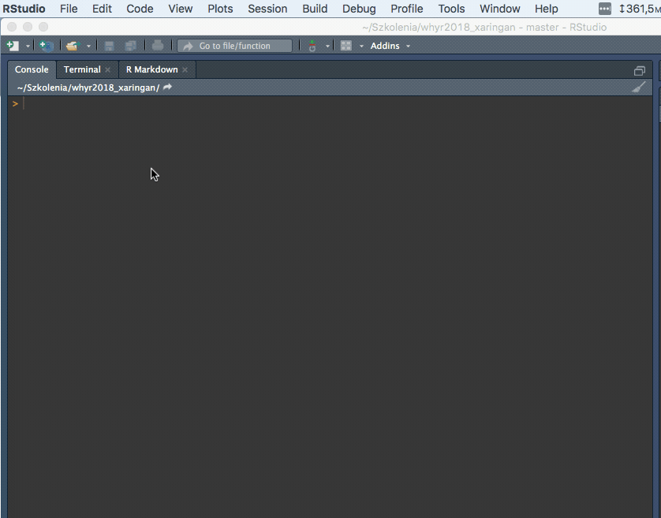

```{r setup, include=FALSE}
options(htmltools.dir.version = FALSE)
```

class: center, middle, inverse

# Who we are

---
class: slide-map
# Where are we

```{r echo=FALSE}
library(leaflet)

idashIcons <- icons(
  iconUrl = "img/idashMarker.png",
  iconWidth = 70, iconHeight = 70,
  iconAnchorX = 35, iconAnchorY = 60
)

leaflet() %>%
  addTiles() %>%
  setView(lat = 52.4141638, lng = 16.9009557, zoom = 6) %>% 
  addMarkers(lat = 52.4141638, lng = 16.9009557,  icon = idashIcons)

```


---
class: training
# What do we do

--

iDash provides __Data Science training__ focused on developing practical skills.

--

.left-training-col[

]

.right-training-col[
.pull-left[
- Shiny - web apps in R
- Deploying Shiny apps      
- CSS & JS in Shiny     
]
.pull-right[
- Introduction to R     
- Data visualization R    
- Data processing in R  
]
]

<div style="clear:both"></div>
<hr>

--

.left-training-col[

]

.right-training-col[
- Introduction to Python    
- Data processing in Python         
- Data visualization in Python      
]

<div style="clear:both"></div>
<hr>

--

.left-training-col[

]

.right-training-col[
- SQL for beginners    
- Increasing PostgreSQL query performance             
- Advanced analytics with PostgreSQL      
]

---
# How well do we do

<div class = "plotly">
```{r, echo=F, fig.height=6, fig.width=12, message=F, warning=F}
library(plotly)
df <- data.frame(rate = 1:5, cnt = c(0,0, 1, 19, 50))

df <- df %>% 
  mutate(perc = (cnt / sum(cnt)) * 100)

df %>% 
  plot_ly(x = ~rate,
          y = ~ perc,
          hoverinfo = 'text',
          text = ~paste0('<b>', round(perc, 1), '%</b> of the participants rated our training <b>', rate, '/5</b>')) %>% 
  add_bars(marker = list(color = '#0cb4ce')) %>% 
  layout(xaxis = list(title = "Training quality rating (from 1 to 5)",
                      titlefont = list(
                        size = 20),
                      tickfont = list(size = 14)),
         yaxis = list(title = "Percentage of responses",
                      range = c(0, 100),
                      ticksuffix = "%",
                      titlefont = list(
                        size = 20),
                      tickfont = list(size = 14)
                      ),
        legend = list(x = 0.6, y = 0.9, orientation = "h"),
         xaxis = list(fixedrange=TRUE),
         yaxis = list(fixedrange=TRUE),
         margin = list(l = 70, r = 10, b = 50, t = 10)
  ) %>% 
  config(displayModeBar = F)
```
</div>

---
# Plan for today

- Quick R Markdown recap
--

- Basics of xaringan
--

- Modifying the default look
--

- Popular use cases
--

- Presenter features


---
# Technical details

- Github repository: https://bit.ly/2tKWUFH
--

- This repository contains version of this slide deck, that is not yet ready for publishing. You'll try to improve that during this workshop.
--
   
   
<center>Please <b>try to download the repository now</b>.</center>

---
# Technical requirements

Recent versions of:
- R
- RStudio
- Chrome (recommended)

Packages:

```{r eval=FALSE}
install.packages("xaringan")
install.packages("rmarkdown")
install.packages("leaflet")
install.packages("plotly")
install.packages("ggplot2")
install.packages("DT")
```

---
class: center, middle, inverse
# Quick R Markdown recap

---
# Text

One of the core components of a report or a presentation is a simple __text__.

.pull-left[
__Code__
```
This is a sample _piece_ of __text__.
__Two or more spaces__ are needed at the
end of a line to make a newline
```
]
.pull-right[
__Result__   
  
This is a sample _piece_ of __text__.   
__Two or more spaces__ are needed at the
end of a line to make a newline
]

---
# Headers

__Headers__ are a good way to split the document into logical parts.

.pull-left[
__Code__
```
# First level header
## Second level header
### Third level header
```
]
.pull-right[
__Result__   
   
# First level header
## Second level header
### Third level header
]

---
# Unordered lists

.pull-left[
__Code__
```
- Item 1
- Item 2
    - Item 2a
    - Item 2b
        - Item 2b1
```
]
.pull-right[
__Result__   
   
- Item 1
- Item 2
    - Item 2a
    - Item 2b
        - Item 2b1
]

---
# Ordered lists

.pull-left[
__Code__
```
1. Item 1
2. Item 2
3. Item 3
    - Item 3a
    - Item 3b
```
]
.pull-right[
__Result__   
   
1. Item 1
2. Item 2
3. Item 3
    - Item 3a
    - Item 3b

]

---
# Links

Links will work by default if the web address is placed in the file. It's possible also to make a phrase link to a specific website.

--

.pull-left[
__Code__
```
https://idash.pl/en

[Data Science Training](https://idash.pl/en)
```
]
.pull-right[
__Result__   
   
https://idash.pl/en

[Data Science Training](https://idash.pl/en)
]

--

Unfortunately links open in the same tab by default. 

---
# Images

.pull-left[
__Code__
```

```
]
.pull-right[
__Result__   
   

]

---
# R output

R output can be added using an R code block.

.pull-left[
__Code__
````markdown
`r ''````{r echo=FALSE, fig.height = 3.5}
library(ggplot2)
ggplot(mtcars) + 
  aes(mpg, disp) + 
  geom_point() +
  geom_smooth()
```
````
]
.pull-right[
__Result__   
   
```{r message=FALSE, echo=FALSE, fig.height = 3.5}
library(ggplot2)
ggplot(mtcars) + 
  aes(mpg, disp) + 
  geom_point() +
  geom_smooth()
```
]

--

Read more about chunk options <a href = "https://yihui.name/knitr/options/" target = "_blank">here</a>.

---
# Code blocks

Blocks of code that are not evaluated can be placed using `eval = FALSE`.

.pull-left[
__Code__
````markdown
`r ''````{r eval = FALSE}
library(ggplot2)
ggplot(mtcars) + 
  aes(mpg, disp) + 
  geom_point() +
  geom_smooth()
```
````
]
.pull-right[
__Result__   
   
```{r eval = FALSE}
library(ggplot2)
ggplot(mtcars) + 
  aes(mpg, disp) + 
  geom_point() +
  geom_smooth()
```
]

---
class: center, middle, inverse

# xaringan

### /ʃæ.'riŋ.ɡæn/

---
# xaringan

R package for creating __elegant__, fully __customisable__ slideshows using RMarkdown syntax.
--

- Uses <a href = "https://remarkjs.com" target = "blank">remark.js</a> under the hood.
--

- Slides are natively compiled to HTML.
--

- They can be styled with CSS.


---
# Installation

xaringan can be installed from CRAN.

```{r eval = FALSE}
install.packages("xaringan")
```
---
# Creating new slide deck

.pull-left[
<center></center>
]

.pull-right[
The file created from template is pre-populated with sample slides. 
]

---
# Compiling the file

Markdown file containing xaringan presentation can be compiled in 2 ways:

- Standard way, that is, by clicking the "Knit" button or using a keyboard shortcut (Ctrl (Cmd) + Shift + k)
- Using the "Infinite Moon Reader" addin. The slide deck is then automatically updated every time we change something and save the file (you can also use `inf_mr(path)` function).
  
<center></center>

---
# Slide creation rules

.pull-left[
- Slides are separated with `---`
- Steps on a single slide are separated with `--`
- Slides usually contain regular RMarkdown content
- Slides can contain HTML elements
]

.pull-right[
Example:
```
(...)
---
# Slide 3
- bullet 1
- bullet 2

--
Some content.

---
(...)
```
]

---
class: inverse
# Exercise 1 (5 min)

Add a new slide (after this one) that has:
- first level heading saying "I want to learn xaringan",
- 3 bullet points describing your motivation.

Bullet points should appear one after another. Try to use the `Infinite moon reader` addin for quick experimentation.

---
# Slide deck configuration

.pull-left[
Slide deck configuration happens on top of the file through the __YAML code block__.

Search help for `moon_reader` to see all available options specific to xaringan.
]
.pull-right[
```yaml
---
title: "A Cool Presentation"
output:
  xaringan::moon_reader
    yolo: true
    nature:
      autoplay: 30000
---
```
]

---
class: inverse
# Exercise 2 (3 min)

Using the YAML setting, change the format of the slides to widescreen (16:9).

---
# Improving links

As mentioned earlier, pure HTML code can be inserted into the markdown file. One case when this could be useful is creating links that open in a new tab (RMarkdown does not let us do that by default).

--

To do that we need to replace the current link with the HTML tag that creates a link (anchor tag).

```
<a href = "web address" target = "_blank">link text</a>
```

---
class: inverse
# Exercise 3 (5 min)

Make the word "iDash" on slide 4 ("What do we do") link to the iDash website (`https://idash.pl/en`). The page should open in a new tab.

---
# Slide layout

Slide content can be easily divided into 2 equal columns. To do this we need to use the following structure:

```
.pull-left[
  Content to go to the left column
]
.pull-right[
  Content to go to the right column
]
```

---
# Slide layout

We can also divide page in 2:8 ratio by using the following structure:

```
.left-column[
  Content to go to the left column
]
.right-column[
  Content to go to the right column
]
```

---
class: inverse
# Exercise 4 (5 min)

Split the content on slide 8 ("Technical requirements") into two equal columns. "Recent versions of:" should go to the left and "Packages:" should go to the right. Bold the titles.

---
# Background image

.pull-left[
  Background image can be added to any slide by specifying the `background-image` parameter at the beginning of the slide.
]
.pull-right[
Example:
```
(...)
---
background-image: url(path to the image)
# Slide 3
Some  content.
---
(...)
```
]

---
class: inverse
# Exercise 5 (5 min)

Add a new slide (after this one) with 'wroclaw.jpg' file (in the img directory) as a background. Add first level heading that says: "I ♥ Wrocław"

---
class: inverse, center, middle

# xaringan & CSS


---
# CSS

CSS (Cascade Style Sheets) is a language used to define aesthetics of HTML documents.

--

Since xaringan is compiled to HTML file, the look of the slides is entirely determined by CSS rules.

--

Although some default styles are provided, users are free to modify them and customize slides to suit their needs.

--

CSS gives you a __full control__ on how the slides look. This means that __everything is possible__ when it comes to the design of your slides.

---
# CSS

The basic term in CSS is the __class__.

--

Class contains a set of aesthetic rules that can be applied to an HTML element.

--

You might have already noticed the "class: inverse" statement at the beginning of some of the slides.

---
# CSS

.pull-left[
In order to link defined class with a slide, you have to use `class:` phrase after slide initialisation (`---`).

You can add multiple classes separated by comma.
]

.pull-right[
```{r eval=F}
---
class: middle, center

# Slide content
```
]

---
# CSS - popular slide classes

- __inverse__ - makes the background dark and the font bright.
- __right, left, center__ - horizontal text alignment.
- __top, bottom, middle__ - vertical text alignment.


---
# CSS

.pull-left[
Classes are represented in the CSS files with a dot.
  
This set of attributes will be applied to every element with the "inverse" class. 
]
.pull-right[
```{css eval =  FALSE}
/* Default inverse class */
.inverse {
  background-color: #272822;
  color: #d6d6d6;
  text-shadow: 0 0 20px #333;
}
```
]

---
# CSS

You may also remember the exercise with column splitting where we defined:

```
.pull-left[
  Content to go to the left column
]
```

`pull-left` is a __CSS class__! It contains the rules that makes the content inside take only half of the slide and align it to the left. You can apply any class to the part of the slide content this way (dot on the beginning and content in brackets).

---
class: inverse
# Exercise 6 (5 min)

Add a new slide (after this one) containing first level header saying: "Wow, I'm using CSS".

Using built in CSS classes make the slide have dark background and bright text. Make the text aligned to the bottom, center of the slide. 

---
# Modyfing the CSS

If you want to further customize the look of the slides, it's good to start with the default CSS theme files (<a href = "https://github.com/yihui/xaringan/blob/master/inst/rmarkdown/templates/xaringan/resources/default.css" target = "_blank">default.css</a> and <a href = "https://github.com/yihui/xaringan/blob/master/inst/rmarkdown/templates/xaringan/resources/default-fonts.css" target = "_blank">default-fonts.css</a>).

--

You can download them and link them in the YAML section of the document giving the proper paths:

```yaml
---
output:
  xaringan::moon_reader:
    css: ["default.css", "default-fonts.css"]
---
```

---
class: inverse
# Exercise 7 (10 min)

Add the default CSS files to your slide deck (default.css & default-fonts.css). Examine their contents and try to:

- Change the default link color to `#0cb4ce`.
- Change the background of the slides with the class `inverse` to black (`#000`).
- Try changing the font to 'Open Sans'. Is it working?

---
# Fonts

Changing just the `font-family` will work only when chosen font is installed on the viewer's machine.

--

To make sure that we'll be showing proper font to everyone, it's best to load the font from external source. A good source of free fonts is <a href="https://fonts.google.com/" target="_blank">GoogleFonts</a>.

---
class: inverse
# Exercise 8 (5 min)

- Add Open Sans font from Google Fonts to your CSS file.
- Make sure that the font-family is set to 'Open Sans' in the CSS file.

---
class: inverse
# Exercise 9 (10 min)

Change the font size of the first level heading to `45px`. Make font bold. 

Use this piece of CSS code.

```{css eval = FALSE}
.remark-slide-content h1 {
  /* CSS rules goes here */
}
```

Try to look for proper CSS rules in other parts of the CSS file and reuse them.

---
# Slide number format

Slide number format can be customised using the `slideNumberFormat` argument in the document YAML section.

```yaml
output:
  xaringan::moon_reader:
    lib_dir: libs
    nature:
      # Examples
      slideNumberFormat: "%current%"                  # 12
      slideNumberFormat: "Slide %current% of %total%" # Slide 12 of 42
      slideNumberFormat: "%current%/%total%"           # 12/42
```

---
class: inverse
# Exercise 10 (5 min)

1.&nbsp;Change the format of the slide numbering to: "Slide X of Y".

2.&nbsp;Add this piece of code to the CSS file. What do you think will happen?

```{css eval = FALSE}
.remark-slide-number {
  font-size: 9pt;
  right:3%;
  bottom:4%;
  opacity:0.8;
}
```

---
class: inverse

# Exercise 11 (5 min)

.pull-left[
  Let's make the logo appear in the bottom right corner.
  
  1. Add first chunk of code on the right to the CSS file.
  2. On each slide you want the logo to show up add the second chunk of the code on the right (proper HTML tag).
]

.pull-right.small-code[
```{css eval = FALSE}
.corporate-logo {
  background-image: url('img/logo-dark.png');
  position:absolute;
  bottom:5.5%;
  right:3%;
  width:95px;
  height:44px;
  background-size: 100% 100%;
}

.inverse .corporate-logo {
  background-image: url('img/logo-light.png');
}
```

```{html}
<div class="corporate-logo"></div> 
```
]
---
class: inverse, center, middle
# Chrome DevTools


---
## Chrome DevTools

Chrome Developer Tools is a set of tools built in Chrome that allows to quickly diagnose problems with the website we're building (and xaringan deck is a kind of a website). It allows to:

- view the HTML structure,
- view the CSS styles,
- edit HTML and CSS in real time.

---
## Opening Chrome DevTools

We can use keyboard shortcuts to open Chrome Dev Tools:

- Control(Command on Mac) + Shift + I,
- F12 (Windows only).

--

.pull-left[You can also right-click any element on the website and select "Inspect".]

.pull-right[<center></center>]

---
## Chrome DevTools - HTML & CSS preview

"Elements" tab shows us a preview of the HTML code.

If you click an element, the CSS styles that influence given element will show up on the right.

<center></center>

---
class: inverse
# Exercise 12 (20 min)

1.&nbsp;Change the title slide background to the `japan.jpg` image located in the `img` project directory.

2.&nbsp;With the help of Chrome Developer Tools try to write CSS rules that would make the first slide look as close to the one presented below as possible.

<center></center>

---
class: inverse, center, middle

# Sharing your slides

---
# Sharing the files

There are few ways you can share your slides.   

--

First is obvious. You can send it via email or any other file sharing service.   

--

However, it's important to note that all additional files we've added (CSS, images) along with the "libs" and presentation directories __need to be shared with the HTML file__. There's no need to include the .Rmd though.

---
# Sharing the files

It's also good to note, that the slides __won't work without internet connection__ by default. You also won't be able to work on the slide deck if you're offline. That's because remark.js library (needed for the slides to work) is sourced from a remote web location. However, there's an easy way to deal with it if you need to.

--

You can download the copy of remark.js using the `xaringan::summon_remark()` function and then link this copy on the top of you markdown file:

```yaml
output:
  xaringan::moon_reader:
    chakra: libs/remark-latest.min.js
```

---
# PDF

It's also relatively easy to export your slides to PDF using Chrome. All you need to do is open the resulting HTML file and print it to the PDF.

--

Unfortunately, this way you loose all the interactivity of the slide elements (like interactive plots).

--

However, sometimes Chrome doesn't convert slides correctly. In this case, `dectape.js` could solve any problem.

---
# Sharing online

This is the __best way to do it__! HTML files are made to be viewed in a browser.

--

You can use any web hosting for storing your slides but there's much easier way to do it.

--

Most of us use services like github while working on a project. If you already have your slides on github, you can play them __directly from there__ using the <a href = "https://rawgit.com" target = "_blank">rawgit.com</a> service. Paste the link to the source HTML file from github there and rawgit will produce a link to a viewable version.

---
class: inverse, center, middle

# Presenting


---
# Presenter notes

Notes can be easily added to any slide.

```
---
# Slide 3

Slide content

???

My awesome notes
---
```

---
# Presenter mode

You can view them by entering the presenter mode (hit "P" on the keyboard).

???

Yeah! Notes are here!
---
# Autoplay

Another useful option while presenting is setting the autoplay for your slides. This can be especially useful for giving short or lightning talks on conferences.

--

```yaml
output:
  xaringan::moon_reader:
    nature:
      autoplay: 20000
```

--

Note that the time is given in milliseconds!

---
# Useful shortcuts

- __h__ - open help with shortcuts ;)
- __f__ - toggle full screen mode
- __number + return__ - go to specific slide
- __c__ - clone the slideshow

---
# Other useful features of xaringan

- LaTeX formulas
- Macros
- Themes
- Highlighting lines in code chunks

---
# Useful resources

- <a href="https://github.com/yihui/xaringan/wiki" target = "blank">xarigan wiki</a>
- <a href="https://github.com/gnab/remark" target = "blank">remark.js project site</a>

---
class: inverse, bottom, center
background-image: url('img/logo-light.png')

mo@idash.pl | mb@idash.pl
